# Urban Logistics Demand Forecasting – Melbourne

## 📊 Project Overview

This project analyses and forecasts urban freight demand patterns in Melbourne using transport activity sensor data as a proxy for last-mile delivery activity. The goal is to understand temporal and spatial demand behaviour and build predictive models to support city logistics planning, freight management, and traffic regulation.

The study applies statistical and deep learning approaches — **SARIMA**, **Prophet**, and **LSTM** — to model complex time-series patterns in urban logistics demand.

---

## 🎯 Objectives

- Analyse hourly, daily, and monthly logistics demand patterns
- Identify peak congestion periods and low-traffic windows
- Evaluate weekday, weekend, holiday, and event impacts
- Build and compare predictive models for demand forecasting
- Translate forecasts into actionable city planning recommendations

---

## 📁 Dataset

- **Source:** City of Melbourne Open Data – Transport Activity Counts
- **Period:** 2023–2026
- **Granularity:** Hourly vehicle counts across 36 transport sensors
- **Vehicle Types:** Vans and trucks only (used as a proxy for urban freight activity)

---

## ⚙️ Project Workflow

1. Data preparation and feature engineering
2. Exploratory data analysis
3. STL decomposition and anomaly detection
4. Stationarity and autocorrelation analysis
5. Spatial demand analysis
6. Forecasting using SARIMA, Prophet and LSTM
7. Operational recommendations for city logistics planning

---

## 📈 Model Performance

| Model | MAE | RMSE | MAE % |
|-------|------:|------:|------:|
| SARIMA | 43.42 | 70.16 | 61.7% |
| Prophet | 34.62 | 49.55 | 49.2% |
| **LSTM** | **13.23** | **21.26** | **18.8%** |

LSTM substantially outperformed both statistical baselines by learning nonlinear temporal patterns and adapting to the structural demand increase observed in late 2025.

---

## 🔍 Key Insights

### ⏰ Temporal Patterns

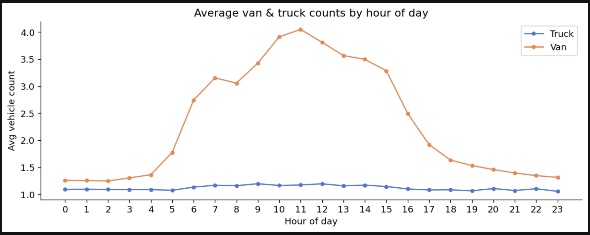

- Freight demand peaks between **10 AM and 12 PM**, with the highest activity around **11 AM**.
- Vans account for most demand variation, while truck traffic remains comparatively stable.
- Overnight demand is minimal before increasing rapidly during the morning.

---

### 📅 Day-of-Week Trends

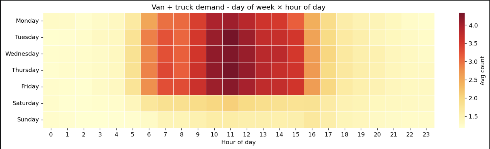

- **Wednesday** experiences the highest logistics demand.
- **Sunday** records the lowest activity.
- Weekday peak demand consistently occurs between **9 AM and 1 PM**.

---

### 📈 Monthly Demand Trend

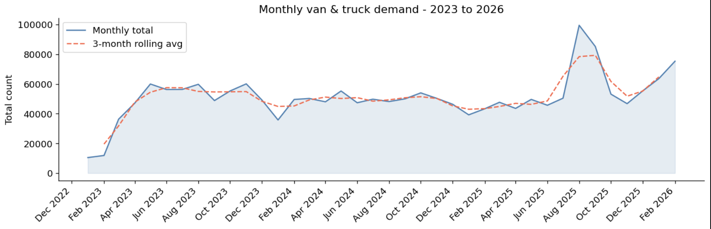

Demand increased rapidly during early 2023, remained relatively stable through 2024–2025, and experienced a clear structural increase during late 2025.

---

### 🔬 STL Decomposition

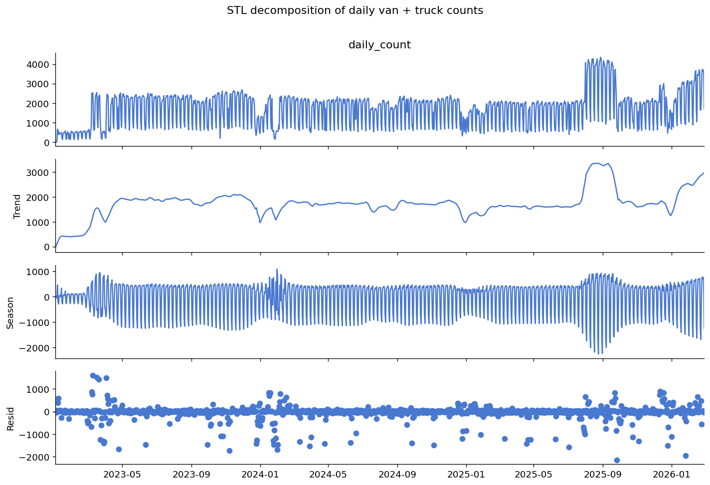

STL decomposition confirms strong weekly seasonality together with a long-term upward trend and a noticeable structural shift in late 2025.

---

### 🚨 Anomaly Detection

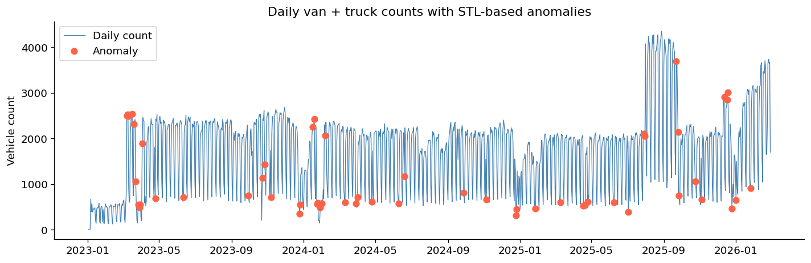

Daily anomaly analysis identified demand spikes and suppressions associated with major Melbourne events and public holidays.

---

### 🎉 Event Analysis

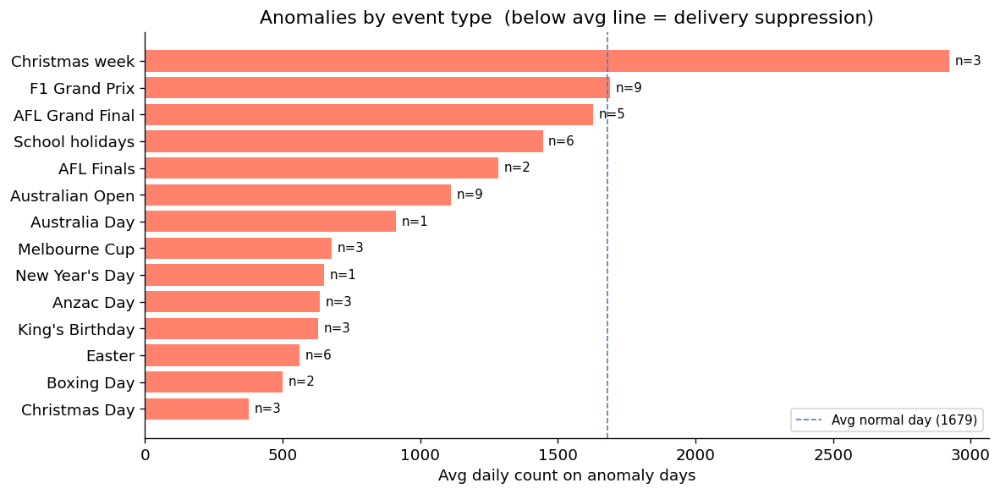

Large sporting events and festivals consistently increase freight demand, while Christmas Day and Boxing Day produce the lowest traffic volumes across the dataset.

---

### 🏙️ Spatial Demand Distribution

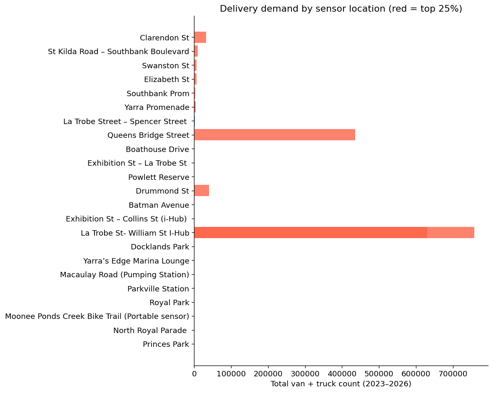

The majority of freight activity is concentrated within only a few transport sensors, with Queens Bridge Street representing the largest share of observed logistics demand.

---

### 🗺️ Geographic Distribution

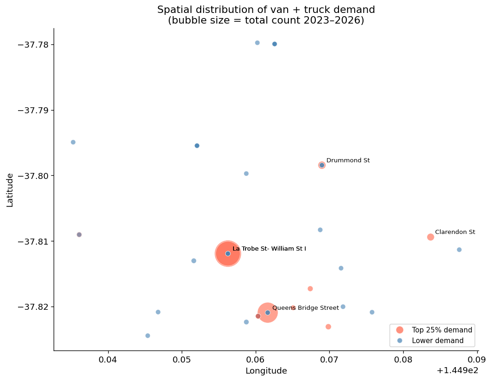

High-demand sensor locations cluster around Melbourne's CBD and Southbank corridor, highlighting the city's primary last-mile logistics zone.

---

## 📊 Forecasting Results

### SARIMA Forecast

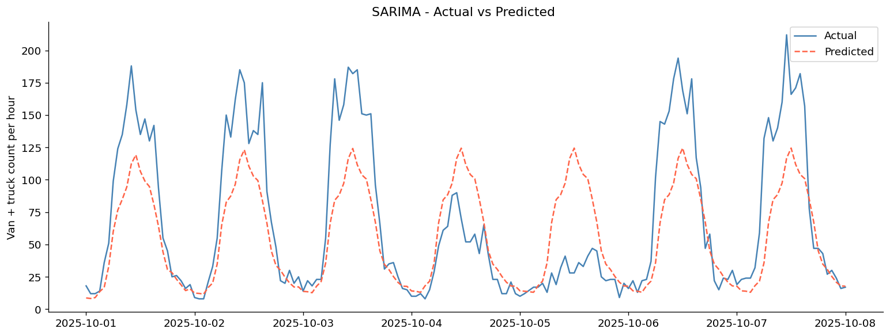

SARIMA captures the recurring seasonal pattern but struggles to adapt after the structural increase in demand during late 2025, leading to the highest forecasting error among the evaluated models.

---

### Prophet Forecast

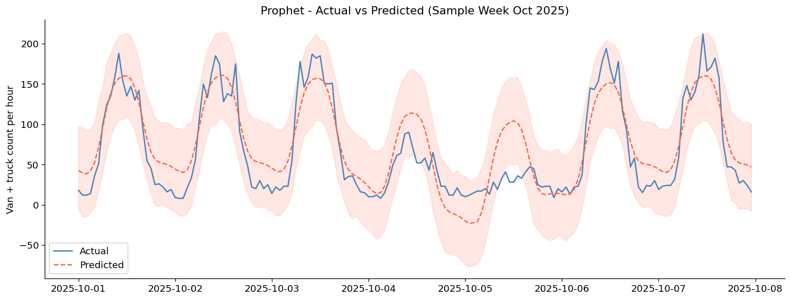

Prophet models the overall trend and seasonality more effectively than SARIMA but still underestimates peak demand following the structural shift.

---

### LSTM Forecast

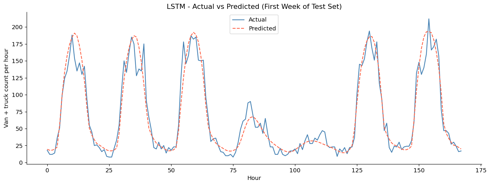

LSTM provides the closest fit to the observed demand, successfully capturing nonlinear temporal relationships and adapting to the higher demand baseline. This results in the lowest MAE and RMSE of all three models.
---

## 🏙️ City Planning Recommendations

- Prioritise loading zones within the CBD and Southbank corridor during weekday peak periods.
- Schedule road maintenance during weekends and public holidays when freight demand is lowest.
- Prepare additional logistics access during major annual events.
- Update planning models to reflect the higher post-2025 freight demand baseline.
- Retrain forecasting models periodically as new transport data becomes available.

---

## 🧠 Key Takeaway

Urban logistics demand in Melbourne is highly structured, seasonal, and event-driven rather than random. Among the evaluated forecasting models, **LSTM achieved the highest predictive accuracy**, demonstrating the value of deep learning for modelling complex urban freight demand patterns.

---

## 🛠️ Tech Stack

- **Python**
- **Pandas**
- **NumPy**
- **Matplotlib**
- **Seaborn**
- **Statsmodels**
- **Prophet**
- **TensorFlow / Keras**

---

## 🚀 Future Improvements

- Integrate weather and traffic conditions
- Include economic indicators affecting freight demand
- Deploy the forecasting model as a REST API
- Extend the framework to multiple Australian cities

---

## 📌 Author

**Yuvarani Dharmasivam**

Master of Data Science  
Deakin University
